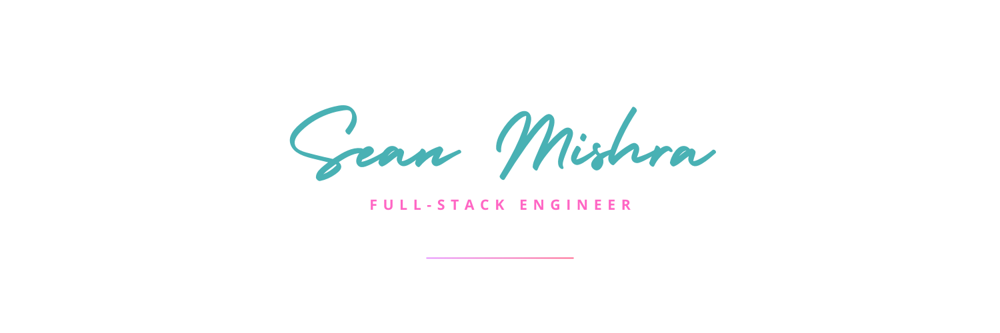

<!-- insert banner image from assets/images -->

### hello //

I am Sean — a software engineer  based in Greater St. Louis, MO, USA.

– Currently working as a Software Engineer at [Morrowcraft](https://morrowcraft.com).
– Building side projects such as [Been A While](https://beenawhile.app) and [AO Toolkit](https://aotoolkit.com).
– Working on a brand for my side projects at [The Rusty Token](https://therustytoken.com).

### about //

I'm a full-stack software engineer who builds scalable, user-focused web and mobile apps. With strong product sense and an eye for clean design, I blend frontend finesse and backend architecture to ship fast and iterate even faster.

I've navigated startups, small businesses and indie projects, building everything from quick MVPs to robust, production-scale systems. While I center around JavaScript, React, Node.js, and modern cloud platforms, I'm always open to exploring new tech when the project calls for it.

Beyond coding, I care deeply about good UX, thoughtful design, and the meaningful impact of the products I create. I'm always shipping, always iterating, and always on the hunt for problems worth solving.

[More about me →](https://seanmishra.com/about)

### stack //

<table>
<tr>
<th>Frontend</th>
<th>Backend</th>
<th>DevOps</th>
<th>Tooling</th>
</tr>
<tr>
<td style="vertical-align: top;">
<a href="https://react.dev/">React</a> 
<a href="https://nextjs.org/">Next.js</a> 
<a href="https://www.typescriptlang.org/">TypeScript</a> 
<a href="https://tailwindcss.com/">Tailwind CSS</a> 
<a href="https://developer.mozilla.org/en-US/docs/Web/JavaScript">JavaScript</a> 
<a href="https://reactnative.dev/">React Native</a> 
<a href="https://d3js.org/">D3</a> 
<a href="https://motion.dev/">Motion</a> 
<a href="https://gsap.com/">GSAP</a> 
<a href="https://lottiefiles.com/">Lottie</a> 
<a href="https://storybook.js.org/">Storybook</a>
</td>
<td style="vertical-align: top;">
<a href="https://nodejs.org/">Node.js</a> 
<a href="https://mongodb.com/">MongoDB</a> 
<a href="https://expressjs.com/">Express</a> 
<a href="https://www.mysql.com/">MySQL</a> 
<a href="https://www.postgresql.org/">PostgreSQL</a> 
<a href="https://redis.io/">Redis</a> 
<a href="https://supabase.com/">Supabase</a> 
<a href="https://clerk.com/">Clerk</a> 
<a href="https://oauth.net/2/">OAuth2</a> 
<a href="https://jestjs.io/">Jest</a> 
<a href="https://testing-library.com/">Testing Library</a>
</td>
<td style="vertical-align: top;">
<a href="https://docker.com/">Docker</a> 
<a href="https://railway.app/">Railway</a> 
<a href="https://github.com/features/actions">GitHub Actions</a> 
<a href="https://about.gitlab.com/topics/ci-cd/">CI/CD pipelines</a> 
<a href="https://vercel.com/">Vercel</a> 
<a href="https://firebase.google.com/">Firebase</a> 
<a href="https://www.heroku.com/">Heroku</a> 
<a href="https://aws.amazon.com/">AWS (S3, Lambda)</a> 
<a href="https://kubernetes.io/">Kubernetes</a>
</td>
<td style="vertical-align: top;">
<a href="https://git-scm.com/">Git</a> 
<a href="https://code.visualstudio.com/">VSCode</a> 
<a href="https://linear.app/">Linear</a> 
<a href="https://www.atlassian.com/software/jira">Jira</a> 
<a href="https://www.postman.com/">Postman</a> 
<a href="https://www.warp.dev/">Warp</a> 
<a href="https://www.figma.com/">Figma</a>
</td>
</tr>
</table>

### writing //

<!-- BLOG-POST-LIST:START -->
*Coming soon - stay tuned for insights on full-stack development, product building, and more!*
<!-- BLOG-POST-LIST:END -->

### connect //

I'm always open to discussing new opportunities, collaborations, or projects. Whether you have something specific in mind or just want to connect, feel free to [**reach out**](https://seanmishra.com/contact).

**Currently available for:**
🟢 Full-time & Contract roles
🟢 Projects & Consulting
🟢 Content Collaborations
🚫 Mentorship (Slots full for 2025)
🟢 Speaking & Debate

---

### Let's build something together
*Looking for new opportunities and interesting projects. Always excited to discuss technical challenges and potential collaborations.*

